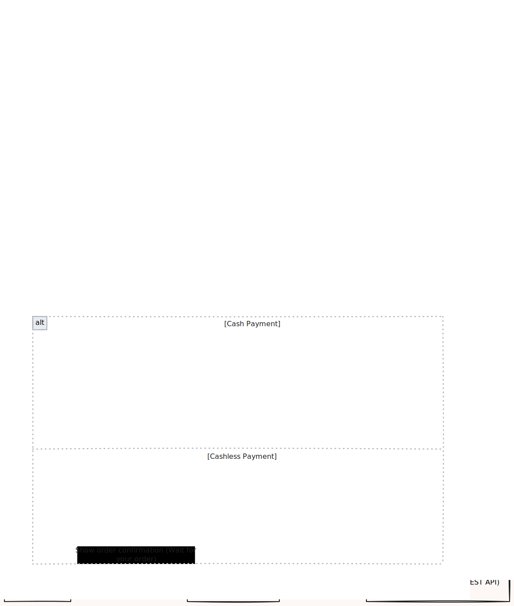

# Overview

**Purpose:** Bridge layer connecting self-ordering kiosks to legacy POS applications

KwikPOS API serves as an on-premise adapter that enables modern self-ordering kiosks to communicate seamlessly with legacy POS applications, particularly Chase POS, without requiring modifications to the existing POS software.

## Tech Stack

- **Framework:** Spring Boot 3.5.4
- **Runtime:** Java 17
- **Deployment:** Apache Tomcat 10.0
- **Deployment Location:** On-premise POS machine

## System Architecture

The following sequence diagram illustrates how the KwikPOS API processes orders from kiosks to the legacy POS system:

## Key Features

### Kiosk Integration
- API server for self-ordering kiosk integration
- Real-time order transmission from kiosks to POS terminals
- Support for modern kiosk interfaces

### Data Transformation
- Data transformation layer between modern kiosks and legacy POS systems
- Format conversion and data mapping
- Protocol adaptation

### Legacy POS Compatibility
- Compatibility layer for Chase POS integration
- Direct integration with legacy POS applications

### Local Server
- Runs as local server on POS machine
- Handles requests from nearby kiosks
- Low-latency local network communication

## Main Highlight

**This adapter enables our modern self-ordering kiosk products to seamlessly communicate with legacy POS applications, particularly Chase POS, and possibly other POS applications if requested.**

This is the key value proposition:

- Modern kiosk interface maintained
- Seamless integration
- Minimal disruption to existing operations

## Quick Links

- [Responsibilities](responsibilities.md) - Core system responsibilities
- [Deployment Architecture](deployment.md) - Infrastructure and deployment details
- [Development Setup](setup.md) - Local environment configuration
- [Project Structure](structure.md) - Code organization and architecture
- [Development Tasks](development.md) - Common development workflows
- [Testing](testing.md) - Testing strategies and practices
- [Architecture Considerations](architecture.md) - Design principles and patterns
- [Troubleshooting](troubleshooting.md) - Common issues and solutions
- [Roadmap & Planned Work](roadmap.md) - Future features and integrations

## Getting Help

If you encounter issues:

- **Technical Questions:** Reach out to the development team, or you may contact the original author of the codebase via email (<a href="mailto:adrnmlgrto.dev@gmail.com" target="_blank">adrnmlgrto.dev@gmail.com</a>)
- **Integration Issues:** Consult with technical support or helpdesk
- **Deployment Problems:** Contact on-site technical support or helpdesk
- **Architecture Questions:** Review adapter patterns or consult senior developers
- **Kiosk Issues:** Check with KwikPOS Pro development team
